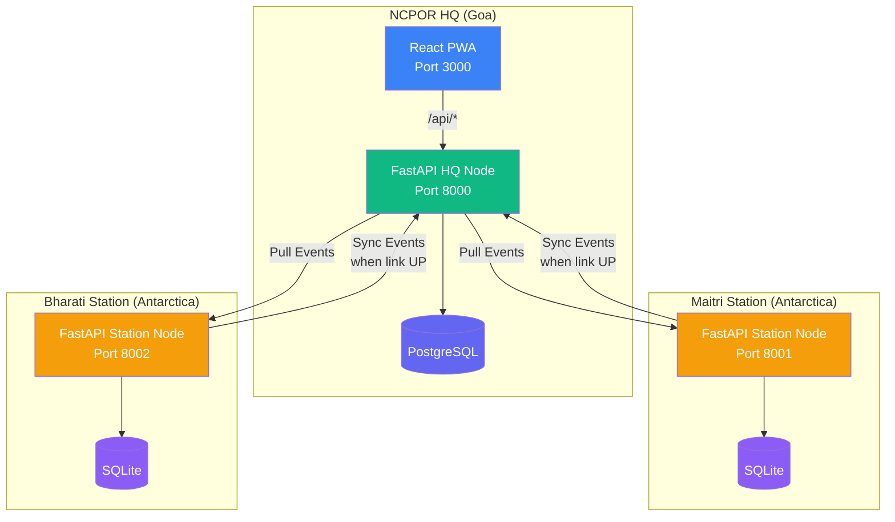
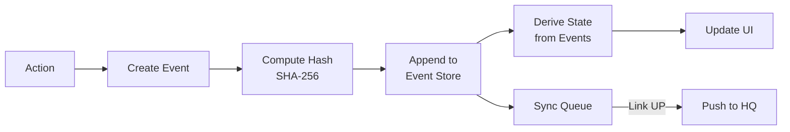

# DHRUVA — ध्रुव
### Digital Hub for Resource Utilization & Voyage Administration
**Smart India Hackathon 2026 | Problem Statement SIH26062**
*Ministry of Earth Sciences / NCPOR — Indian Polar Programme*

---

## 🏔️ Overview

DHRUVA is a centralized digital platform for India's polar expedition operations, covering:

1. **Expedition Planning** — Multi-leg voyage scheduling with Gantt timelines
2. **Cargo Tracking** — QR-based checkpoint tracking with vessel position mapping
3. **Inventory Management** — Stock ledger with consumption logging and expiry alerts
4. **Personnel Movement** — Roster management, buddy sorties with automated escalation
5. **Emergency Response** — Incident management with triage, escalation and medevac requests

**Unique Features:**
- 🔗 **Tamper-Evident Audit Chain** — SHA-256 hash chain on every event, with verification UI
- 📡 **Offline-First Architecture** — Stations work fully offline, sync when link returns
- 🎯 **Survival Margin Engine** — Deterministic, explainable days-of-stock calculation with tier alerts
- 🔄 **Event Sourcing** — All state derived from append-only events, enabling perfect sync

## 🏗️ Architecture



### Event Sourcing Model



Every state change creates an immutable event:
```json
{
  "id": "uuid",
  "node_id": "maitri",
  "type": "inventory.consumed",
  "payload": {"item_id": "...", "quantity": 5},
  "actor": "maitri_lead",
  "created_at": "2026-12-15T08:30:00Z",
  "lamport_clock": 42,
  "prev_hash": "abc123...",
  "hash": "def456..."
}
```

### Survival Margin Engine

```
days_of_stock = quantity / (avg_daily_consumption × safety_factor)
survival_margin = days_of_stock − days_to_next_dependable_resupply
```

| Tier | Margin | Color |
|------|--------|-------|
| 🟢 GREEN | ≥ 30 days | Safe |
| 🟡 AMBER | 10–29 days | Monitor |
| 🔴 RED | 0–9 days | Critical |
| ⬛ BLACK | < 0 or no resupply | Emergency |

Safety factors: C1 (life-critical) = 1.5×, C2 (operational) = 1.25×, C3 (routine) = 1.0×

## 🚀 Quick Start

### Prerequisites
- Docker & Docker Compose

### Run
```bash
docker compose up --build
```

### Access
| Service | URL |
|---------|-----|
| **Frontend** | http://localhost:3000 |
| HQ Backend | http://localhost:8000 |
| Maitri Station | http://localhost:8001 |
| Bharati Station | http://localhost:8002 |
| API Docs | http://localhost:8000/docs |

## 👤 Demo Credentials

| Role | Username | Password | Access |
|------|----------|----------|--------|
| HQ Planner | `admin` | `admin123` | All expeditions, all stations, planning |
| Voyage Leader | `voyage1` | `voyage123` | Voyage, cargo scans, vessel position |
| Station Lead (Maitri) | `maitri_lead` | `maitri123` | Maitri inventory, personnel, sorties |
| Station Lead (Bharati) | `bharati_lead` | `bharati123` | Bharati inventory, personnel, sorties |
| Medical Officer | `medical1` | `medical123` | Clearance statuses, medical incidents |

## 🎬 Demo Script

Navigate to the **Demo** page (sidebar → Demo) for a guided walkthrough, or follow manually:

### Step 1: View Command Console
1. Log in as `admin` / `admin123`
2. View the Dashboard — see the Survival Margin heatmap
3. Note items already in RED tier (Emergency Heating Fuel)

### Step 2: Delay Ship Leg
1. Go to Expeditions → click the expedition
2. Click "Delay Leg" on Leg 2 (Cape Town → Maitri), enter 7 days
3. Watch margins recompute — more items turn RED/BLACK
4. View the re-sequenced manifest showing new offload priority

### Step 3: Go Offline
1. Go to Sync Status → toggle Maitri link to DOWN
2. Observe the "Link DOWN" indicator and pending sync badge

### Step 4: Offline Operations at Maitri
1. Log in as `maitri_lead` / `maitri123`
2. Go to Inventory → log diesel consumption (50 liters)
3. Go to Cargo → scan a crate QR → mark as STORED
4. Go to Personnel → create a buddy sortie → let check-in timer expire
5. Watch escalation: WARNING → ALERT → EMERGENCY (accelerated in demo mode)

### Step 5: Sync
1. Go to Sync Status → toggle Maitri link to UP
2. Click "Sync Now"
3. Watch events flow to HQ — see pending count drop to zero
4. Log in as `admin` — see all Maitri events in the audit trail

### Step 6: Tamper Detection
1. Go to Audit Trail
2. Click "Tamper Event" (demo button)
3. Click "Verify Chain" — see the broken link detected with details

## 📁 Tech Stack

| Layer | Technology |
|-------|-----------|
| Frontend | React 18 + Vite + TypeScript |
| Styling | Tailwind CSS |
| Offline | IndexedDB via Dexie |
| Maps | Leaflet + React-Leaflet |
| QR Scanning | html5-qrcode |
| Backend | Python FastAPI |
| HQ Database | PostgreSQL 15 |
| Station Database | SQLite |
| Auth | JWT with role-based access |
| Deploy | Docker Compose |

## 🧪 Running Tests

```bash
# From the backend directory
cd backend
pip install -r requirements.txt
pytest tests/ -v
```

Tests cover:
- ✅ Survival Margin engine (calculation, tiers, safety factors)
- ✅ Manifest ranking (criticality × margin deficit)
- ✅ Hazmat conflict detection (IMDG compatibility)
- ✅ Hash chain verification (append, verify, tamper detection)
- ✅ Sync merge (idempotent, no duplicates)
- ✅ Escalation timers (WARNING → ALERT → EMERGENCY)

## 📋 API Documentation

Interactive API docs available at http://localhost:8000/docs (Swagger UI)

### Key Endpoints

| Module | Endpoint | Method | Description |
|--------|----------|--------|-------------|
| Auth | `/api/auth/login` | POST | Login with credentials |
| Expeditions | `/api/expeditions` | GET/POST | List/create expeditions |
| Expeditions | `/api/legs/{id}/delay` | POST | Delay a leg by N days |
| Cargo | `/api/cargo/crates` | GET/POST | List/create crates |
| Cargo | `/api/cargo/checkpoint` | POST | Log checkpoint scan |
| Inventory | `/api/inventory` | GET | List items with quantities |
| Inventory | `/api/inventory/consume` | POST | Log consumption |
| Inventory | `/api/inventory/margins` | GET | Survival margins |
| Personnel | `/api/personnel/sorties` | POST | Create buddy sortie |
| Emergency | `/api/incidents` | GET/POST | List/create incidents |
| Sync | `/api/sync/trigger` | POST | Trigger station sync |
| Admin | `/api/admin/link/{id}` | POST | Toggle link UP/DOWN |
| Audit | `/api/audit/verify` | GET | Verify hash chain |
| Demo | `/api/demo/step/{n}` | POST | Execute demo step |

## 📄 License

Built for Smart India Hackathon 2026. MIT License.

---

**Team DHRUVA** | SIH26062 | Ministry of Earth Sciences / NCPOR
